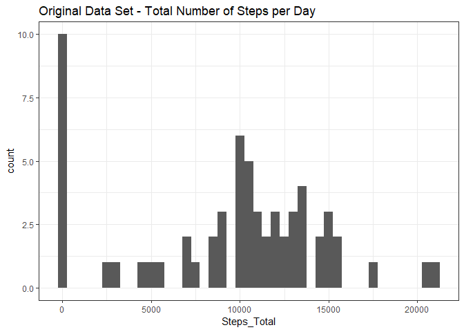
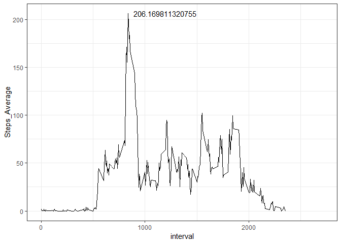
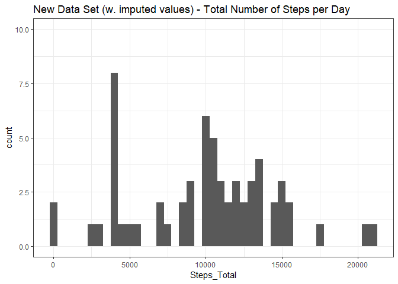
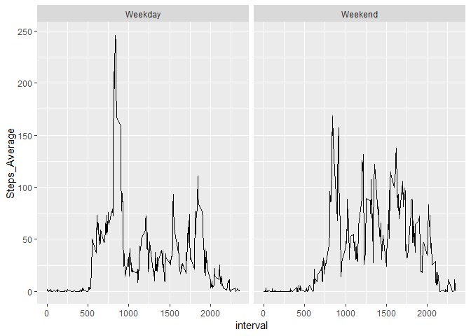

## 1. Loading and processing the data
First, I will load  the packages I will be using.

```r
library(dplyr)
library(ggplot2)
library(VIM)
```
Here, we read in the Activity Monitoring Data, assign the "steps" variable to be class numeric and the "date"" variable to be class date.


```r
act_data <- read.csv("activity.csv")
act_data$date <- as.Date(act_data$date)
act_data$steps <- as.numeric(act_data$steps)
```

## 2. What is the mean total number of steps taken per day?

First, we group the data by Date. Then summarize the grouped data by steps to get the daily total. We then calculate the mean and median of the daily totals and print a table to display the mean number and median number of steps per day. 


```r
act_data_date <- act_data %>% group_by(date)
act_data_grouped_total <- act_data_date %>% 
        summarise(Steps_Total = sum(steps, na.rm = TRUE))
act_date_mean <- mean(act_data_grouped_total$Steps_Total)
act_date_median <- median(act_data_grouped_total$Steps_Total)
results <- as.data.frame(c(act_date_mean, act_date_median), row.names = c("Mean", "Median"))
results <- `colnames<-`(results, "Value")
results
```

```
##           Value
## Mean    9354.23
## Median 10395.00
```

Next, we use the data set created above to create a histogram of total steps taken per day. Bin width of 500 steps was used after testing several values.

```r
total_steps_hist <-
act_data_grouped_total %>%
        ggplot(aes(x = Steps_Total)) +
        geom_histogram(binwidth = 500) +
        theme_bw() +
        labs(title = "Original Data Set - Total Number of Steps per Day")
total_steps_hist
```

<!-- -->

## 3. What is the average daily activity pattern?  

To look at the daily patterns we start by grouping the data by interval. Then we summarize the grouped data to get total steps per interval, total days in the data, and then get the mean of total steps in each interval.

```r
act_data_int <- act_data %>% group_by(interval)
act_data_int_total <- act_data_int %>% 
        summarise(Steps_Total = sum(steps, na.rm = TRUE),
                  Days = n(),
                  Steps_Average = mean(steps, na.rm = TRUE))
act_data_int_total
```

```
## # A tibble: 288 x 4
##    interval Steps_Total  Days Steps_Average
##       <int>       <dbl> <int>         <dbl>
##  1        0          91    61        1.72  
##  2        5          18    61        0.340 
##  3       10           7    61        0.132 
##  4       15           8    61        0.151 
##  5       20           4    61        0.0755
##  6       25         111    61        2.09  
##  7       30          28    61        0.528 
##  8       35          46    61        0.868 
##  9       40           0    61        0     
## 10       45          78    61        1.47  
## # ... with 278 more rows
```

Next, we use the summarized data to plot a line graph with the average steps for each interval. Using the graph (and above table) to identify the highest average, we label the graph with the value of that interval. The interval with the highest average steps is 835, at 206.17 average steps per day.

```r
act_data_int_total %>%
        ggplot(aes(x = interval, y = Steps_Average, 
                   labels = Steps_Average)) +
        geom_line() +
        theme_bw() +
        geom_text(aes(label=ifelse(interval=="835", 
                                   Steps_Average, "")),nudge_x = 360)
```

<!-- -->

##4. Imputing missing values  

First we calculate the number of NA values. Then we identify NA's per day to give us a clear picture of what data is missing and what will be filled in. 

```r
NAcount <- act_data %>%
        count(act_data$steps == "NA")
NAcount <- `colnames<-`(NAcount, c("Steps = NA", "Count"))
as.data.table(NAcount)
```

```
##    Steps = NA Count
## 1:      FALSE 15264
## 2:         NA  2304
```

```r
NAcount_int <- act_data %>% group_by(date)
NAcount_int <- NAcount_int %>% summarise(Steps_NA = sum(is.na(steps)))
NAcount_int
```

```
## # A tibble: 61 x 2
##    date       Steps_NA
##    <date>        <int>
##  1 2012-10-01      288
##  2 2012-10-02        0
##  3 2012-10-03        0
##  4 2012-10-04        0
##  5 2012-10-05        0
##  6 2012-10-06        0
##  7 2012-10-07        0
##  8 2012-10-08      288
##  9 2012-10-09        0
## 10 2012-10-10        0
## # ... with 51 more rows
```

Now we utilize the kNN function to replace the NA values. This function uses the nearest neighbor algorithm to apply regression techniques to approximate the missing values. This assigned to a new object to create a new/separate data set with the imputed values.

```r
new_act_data <- kNN(act_data, variable = "steps", k = 10, dist_var = "interval")
new_act_data <- select(new_act_data, -steps_imp)
```

With the new data set we calculate the mean and median steps per day to compare to the original data.

```r
new_act_data_date <- new_act_data %>% group_by(date)
new_act_data_grouped_total <- new_act_data_date %>% 
        summarise(Steps_Total = sum(steps, na.rm = TRUE))
new_act_date_mean <- mean(new_act_data_grouped_total$Steps_Total)
new_act_date_median <- median(new_act_data_grouped_total$Steps_Total)
new_results <- as.data.frame(c(act_date_mean, new_act_date_mean, act_date_median, new_act_date_median), row.names = c("Orig Mean", "New Mean", "Orig Median", "New Median"))
new_results <- `colnames<-`(new_results, "Value")
new_results
```

```
##                 Value
## Orig Mean    9354.230
## New Mean     9878.426
## Orig Median 10395.000
## New Median  10395.000
```

To visualize the comparision we create a histogram with the new data set and print the original histogram.

```r
new_total_steps_hist <- new_act_data_grouped_total %>%
        ggplot(aes(x = Steps_Total)) +
        geom_histogram(binwidth = 500) +
        theme_bw() +
        labs(title = "New Data Set (w. imputed values) - Total Number of Steps per Day") +
        ylim(0, 10)
new_total_steps_hist
```

<!-- -->

```r
total_steps_hist
```

<!-- -->

What we notice is that the number of days with zero steps has reduced substantially (from 10 to 2), which is a result of imputing the values of those days that had all NA values. This moves 8 days to a new bin and the remaining bins stay unchanged.

##5. Are there differences in activity patterns between weekdays and weekends?  

To identify if there are differences in activity patterns between weekdays and weekends we first identify which day of the week each date is by creating a new column in the data set. Then, we mutate the data set with another new column to identify only Sundays and Saturdays as "Weekend" and all other days to be "Weekday". Finally, I remove the identifier column and leave only the "Weekend/day" factor variable column.  

```r
new_act_data$wdays <- wday(new_act_data$date)
new_act_data <- 
        new_act_data %>% mutate(Week_Day = ifelse(
                wdays == 1 | wdays == 7, "Weekend", "Weekday"))
new_act_data$Week_Day <- as.factor(new_act_data$Week_Day)
new_act_data <- select(new_act_data, -wdays)
```

To visualize the comparision we start by grouping the data by interval and then Weekend/day factor. With the data grouped we summarize to get total steps (per interval) and then average steps (per interval). And finally, we plot the compared data sets faceted by Weekend/day. There is a noticable difference in the activity with higher peaks in weekdays and a more even distribution of activty on the weekends.

```r
new_act_data_int <- new_act_data %>% group_by(interval, Week_Day)
new_act_data_int_sum <- new_act_data_int %>%
        summarise(Steps_Total = sum(steps, na.rm = TRUE),
                  Days = n(),
                  Steps_Average = mean(steps, na.rm = TRUE))
ggplot(new_act_data_int_sum, aes(x = interval, y = Steps_Average)) +
        geom_line() +
        facet_wrap(~Week_Day)
```

<!-- -->

## THANK YOU! Feedback always welcome :)
